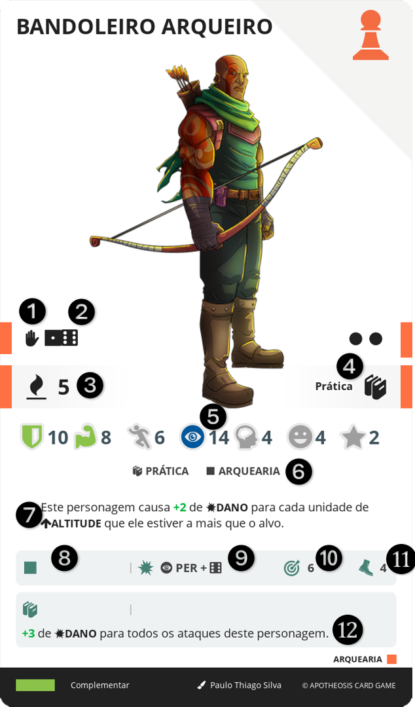

# ALIADO

São personagens humanos, animais ou entidades.

||| :icon-file-moved:

||| :icon-arrow-down-right:
1.	Tipo
2.	Caminho
3.	Valor em VONTADE
4.	Nível e Conhecimentos
5.	Atributos Base: Bônus passivo imediato providos por esta carta
6.	Tipos de Anexos: Texto do efeito desta carta
7.	Efeito: Texto do efeito desta carta
8.	Requerimento
9.	Dano
10.	Alcance
11.	Ação
12.	Efeito da Técnica: Texto do efeito deste movimento carta
|||

Estes não possuem MESA e INVENTÁRIO, e todas as informações pertinentes se encontram em suas respectivas cartas.

## RECRUTAR
Um humano pode adicionar uma ALIADO do BESTIÁRIO ao seu SUPORTE.

Para isso, ele deve estar em um local que permita acesso ao BESTIÁRIO e ao nível da carta, possuir um espaço livre no SUPORTE, e então sacrificar seu turno, enterrar 5 cartas de Recurso que possuam o mesmo CONHECIMENTO e nível, ou superior, ao apresentado na carta de ALIADO.

Se o personagem possuir o CONHECIMENTO e nível apresentado na carta de ALIADO, ele pode enterrar cartas de quaisquer CONHECIMENTO, desde que continue respeitando o requerimento de nível.

Cartas de ALIADO são baixadas levantadas e não podem ser deitadas a não ser por efeito de carta ou pela mecânica de desevocação de uma evocação. Quando um ALIADO está baixado, seus efeitos não podem ser utilizados e devem ser ignorados, sejam eles ativos, passivos ou reativos.

## ABANDONAR
Para enviar um ALIADO do SUPORTE para o BESTIÁRIO, sacrifique o seu turno e descarte a carta desejada.

## EVOLUIR
Você pode evoluir um ALIADO para outra carta de ALIADO de mesmo Caminho e nível imediatamente posterior (1 para 2, 2 para 3), do seu INVENTÁRIO.

1. Anexe quaisquer cartas anexadas à carta anterior à nova carta.
2. Envie a carta anterior para o INVENTÁRIO.

## ANEXOS
Um ALIADO pode ter por padrão até 5 anexos.

Uma vez por turno, durante o turno do Herói, ele pode anexar uma carta do seu inventário a um de seus Aliados, desde que aquele ALIADO não tenha atingido seu limite de anexos.

O Herói pode, em um mesmo turno, desanexar e enviar para o seu INVENTÁRIO quantas cartas quiser anexas a seus ALIADOS, desde que não esteja em combate.

Caso uma carta especifique que será anexada a outra, sendo esta outra um ALIADO no limite de anexos ou acima, o efeito da carta prevalece e deve sim ser anexada ao ALIADO.

### TIPOS DE ANEXOS
Os tipos de anexos marcam características desejadas de cartas anexadas àquele ALIADO.

A característica listada abrange basicamente qualquer característica de uma carta.

Quando o ALIADO possuí cartas anexadas dos tipos listados, elas desbloqueiam técnicas listadas nesta carta de ALIADO.

Além disso, os tipos de anexo adicionam sua quantidade ao limite máximo de anexos que um ALIADO pode ter.

!!!
Por exemplo, se uma carta de ALIADO apresenta 3 tipos de anexo listados, esta carta pode ter um total de 8 cartas anexadas (5+3). Note que nenhuma destas 8 cartas precisa cumprir as características listadas.
!!!

## PAGAMENTO DE CUSTOS
Os ALIADOS podem ser requeridos a pagar certos custos pelo efeito de outras cartas ou mecânica de jogo, como descartar cartas e valores.

Observando que ALIADOS não possuem MESA nem INVENTÁRIO, quando um texto especificar uma ação impossível para um ALIADO, como “descarte do seu INVENTÁRIO” ou “deite 2 de MANA”, o personagem não tem como cumprir aquela exigência, logo, ela deve ser ignorada.

Porém, quando o texto não apresenta uma restrição, por exemplo, “descarte uma carta” ou “descarte pontos de DESTINO”, o ALIADO pode/deve utilizar seus anexos nestes casos. Note que se o custo for obrigatório, o personagem precisa pagar, se for opcional o jogador pode optar.

A mesma consideração deve ser feita quando uma carta é obtida pelo ALIADO, se o texto disser algo como “enviado para o INVENTÁRIO”, o ALIADO não tem como realizar esta ação, mas se o texto apenas diz que a carta é “obtida”, ela pode/deve ser anexada ao aliado, ainda respeitando o limite de anexos.

## MORTE
Quando um ALIADO morrer, sua carta deve ser enterrada no seu respectivo baralho e todas as cartas anexadas devem ser descartadas para a sua respectiva pilha de descarte.

## TÉCNICA

## TIPO

### Humano

### Animal

### Evocação

#### Evocar
A carta de evocação permanece deitada até que seja evocada e não possui peça no tabuleiro. Para ser evocada, é necessário que o evocador (Herói) selecione uma casa adjacente vazia, e pague 3 de MANA.

Quando evocada, a carta é levantada e a peça do personagem evocação é adicionado na casa do tabuleiro selecionada.

Um ALIADO evocado, é colocado no final da fila de turnos na rodada em que é evocado, na rodada seguinte ele é posicionado na fila de turnos conforme sua PER.

#### Desevocar
O evocador pode a qualquer momento do seu turno, desevocar sua evocação, para isto ele anuncia a ação, deita a carta da evocação e remove a peça dela do tabuleiro.

#### Morte
Diferente de outros personagens, quando uma evocação morre, ela é desevocada (sua carta é deitada) e sua peça é removida do tabuleiro, não deixando corpo, se ela possuir cartas anexadas, elas não devem ser descartadas. Quando desevocada dessa forma, ela não pode ser evocada novamente até o final do combate.
