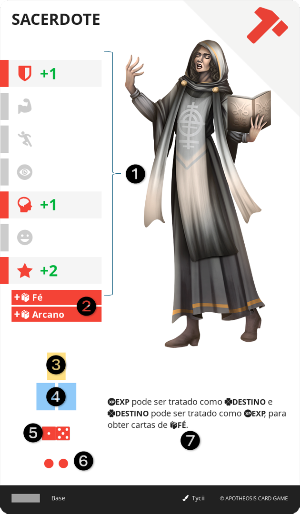

# CLASSE

São os caminhos evolutivos escolhidos pelo personagem. Sua função é principalmente a de adicionar e aprimorar capacidades do personagem. Em um patamar narrativo, representam as escolhas profissionais ou de interesse de estudo e prática daquela pessoa.

||| :icon-file-moved:

||| :icon-arrow-down-right:
1.	Bônus de Atributo: Valores adicionados aos Atributos do personagem
2.	Conhecimentos: Adiciona +1 de nível em cada CONHECIMENTO ao personagem
3.	Espaços de EQUIPAMENTO: Bônus de espaços de EQUIPAMENTO
4.	Espaços iniciais de MEMENTO: Bônus de espaços de MEMENTO
5.	Caminho: Ícone do caminho da CLASSE
6.	Nível da Carta
7.	Efeito: Texto do efeito desta carta
|||

## EVOLUIR
Para adicionar uma nova carta de CLASSE, o personagem precisa estar em um local de TAVERNA, sacrificar seu turno e escolher uma carta acessível.
Se o personagem possuir em sua FICHA, uma CLASSE do mesmo Caminho da carta selecionada e nível imediatamente inferior, o personagem deve enterrar esta sua CLASSE e enterrar mais 3 cartas de recurso, caso contrário, enterre 5 cartas de recurso.
As cartas enterradas devem ser de Recurso e devem possuir o mesmo nível da CLASSE escolhida, ou superior.
A carta deve então ser baixada aberta em um espaço disponível. Se não houver espaços disponíveis, o personagem deve enterrar uma de suas cartas de CLASSE na FICHA.
