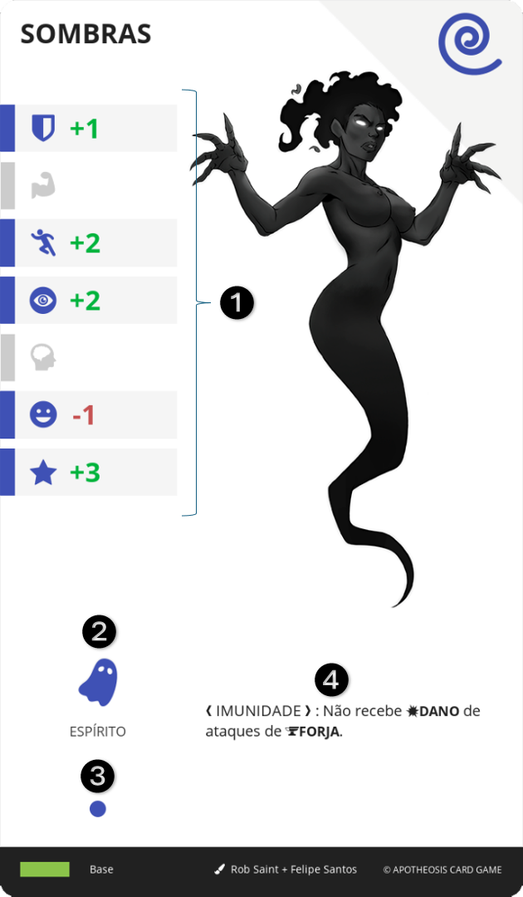

# ENTE

É uma espécie de alma, superior à humana. Um aglomerado de uma forma específica de energia relacionada a uma característica do universo. Carece de consciência, porém, é capaz de agir sobre a natureza.

||| :icon-file-moved:

||| :icon-arrow-down-right:
1.	Bônus de Atributo: Valores adicionados aos Atributos do personagem quando este ENTE está desperto
2.	Tipo: Ícone e nome do tipo deste ENTE, definido pelo nível da carta
3.	Nível da Carta: Equivalente ao seu tipo
4.	Efeito: Texto do efeito desta carta
|||

O personagem (receptáculo) pode incorporar, para seu corpo, estas formas de energia e dominá-las para uso pessoal. Cada corpo humano pode abrigar apenas um ENTE por vez. Ele se mantém adormecido (carta deitada) e pode ser despertado (carta levantada) a qualquer momento, pelo receptáculo. Quando despertado, o corpo do receptáculo é transmutado pelo ENTE.

---

## DESPERTAR
Para despertar seu ENTE, o personagem deve pagar 2 de MANA ou ESTAMINA, ou 1 de MANA e 1 de ESTAMINA. Quando o ENTE estiver desperto, no início de cada um de seus turnos, o personagem pode pagar 2 de MANA ou ESTAMINA ou 1 de MANA e 1 de ESTAMINA, caso contrário, o ENTE adormece.

---

## ADORMECER
O jogador pode adormecer seu ENTE ativamente, a qualquer momento de seu turno. Para isso, basta deitar a carta de ENTE.

---

## INCORPORAR
Cada tipo de ENTE possui um requerimento mínimo de nível para ser incorporado pelo personagem. Quanto mais poderoso o ENTE, mais preparo físico, mental e espiritual, o receptáculo precisa.

Para incorporar, é necessário que o espaço de ENTE esteja disponível e o personagem esteja em uma local de FERIDA. Você deve selecionar uma carta acessível por aquela FERIDA, sacrificar seu turno e enterrar 5 cartas de recurso do mesmo nível que o ENTE selecionado. Baixe a carta, deitada, em sua MESA.

TIPO     | NÍVEL | NÍVEL REQUERIDO DO PERSONAGEM
---      | ---   | ---
Espírito | 1     | 3
Deidade  | 2     | 6
Deus     | 3     | 9

!!!
Quando um DEUS é incorporado, dá-se o nome de **Apoteose**.
!!!

---

## LIBERAR
Para remover o ENTE, o personagem deve sacrificar seu turno e enterrar o ENTE.
