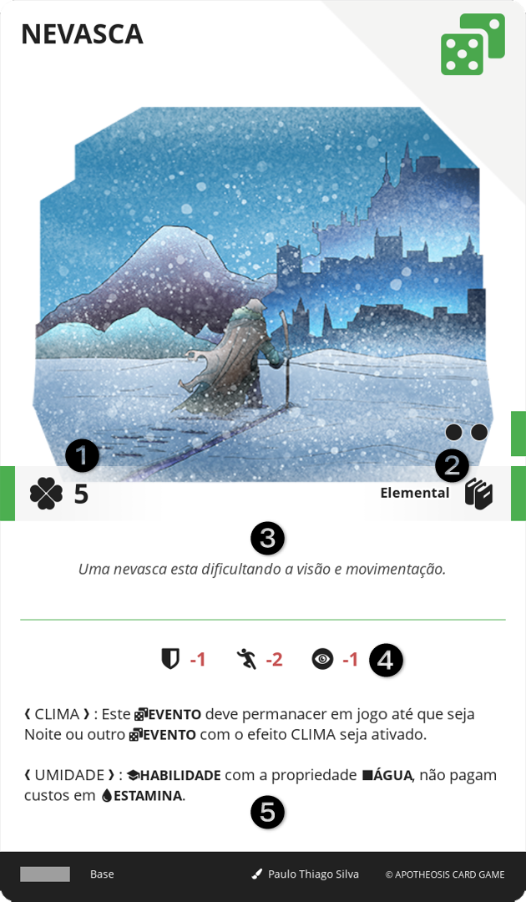

# EVENTO

Representam acontecimentos e situações ocorrendo durante o jogo, como uma abordagem ou mudança de clima.

||| :icon-file-moved:

||| :icon-arrow-down-right:
1.	Valor em DESTINO
2.	Nível e Conhecimentos
3.	Descrição: Texto narrativo ilustrativo
4.	Bônus: Bônus passivo imediato aplicado a todos os personagens
5.	Efeito: Texto do efeito desta carta
|||

## INICIALIZAR
Para obter um EVENTO, é necessário estar em um local de SANTUÁRIO. O personagem deve pagar 4 de AÇÃO, selecionar cartas acessível por aquela SANTUÁRIO e descartar cartas de EVENTO, cuja soma dos valores seja igual ou superior às das cartas selecionadas.

## VIAGEM (TODO)

## DESTINO (TODO)
Caso o personagem de um jogador passe por alguma situação que o levaria à MORTE, o jogador pode gastar 5 DESTINO para sobreviver com 1 VIDA.
