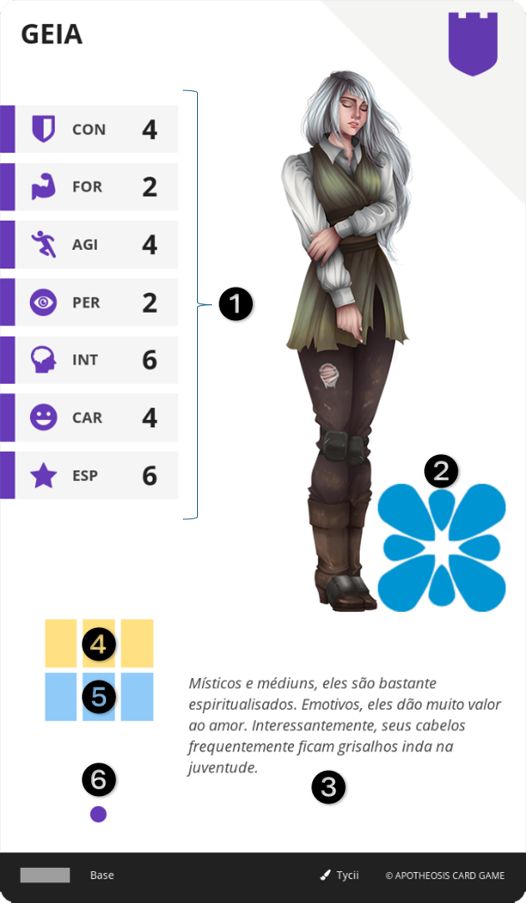

# CASA

É a base de todo Herói, que ao ser criado, começa com uma carta de CASA. Representa um conjunto de várias famílias, diferentes em nome e local, porém ligadas por linhagem sanguínea vinda de um ancestral comum.

||| :icon-file-moved:

||| :icon-arrow-down-right:
1.	Atributos Base: Valores iniciais dos Atributos do personagem
2.	Escudo da Casa: Símbolo ilustrativo da CASA
3.	Descrição: Texto narrativo da CASA
4.	Espaços de EQUIPAMENTO: Toda carta de CASA confere 3 espaços de EQUIPAMENTO
5.	Espaços iniciais de MEMENTO: Toda carta de CASA confere 3 espaços de MEMENTO
6.	Nível da Carta: Toda CASA é sempre de nível 1
|||

---