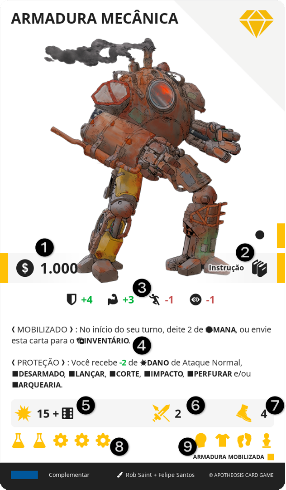

# ITEM

É todo e qualquer objeto físico presente no jogo, geralmente algo que pode ser carregado, como uma arma ou uma fruta. Eles são classificados por tipo, que define um comportamento em comum.

||| :icon-file-moved:

||| :icon-arrow-down-right:
1.	Preço
2.	Nível e Conhecimentos
3.	Bônus: Bônus passivo imediato providos por esta carta
4.	Efeito: Texto do efeito desta carta
5.	Dano
6.	Alcance
7.	Ação
8.	Materiais: Ícones dos materiais
9.	Especificadores: Ícones dos especificadores
|||

## COMPRAR
Para obter ITENS, é necessário estar em um local de MERCADO com o nível igual ou superior ao dos ITENS desejados.

O personagem deve sacrificar o seu turno, selecionar cartas acessíveis por aquele MERCADO e descartar cartas de ITEM, cuja soma dos preços seja igual ou superior à das cartas selecionadas. As cartas obtidas são então enviadas para o INVENTÁRIO.

Se um ITEM não possuir preço, ele pode ser adquirido gratuitamente, desde observadas as demais restrições.

## EQUIPAR
Para baixar um ITEM do INVENTÁRIO para a MESA do personagem, é necessário pagar 2 de AÇÃO e que haja um espaço disponível no EQUIPAMENTO.

## DESEQUIPAR
Para enviar um ITEM do seu EQUIPAMENTO para o seu INVENTÁRIO, pague 2 de AÇÃO.

## FABRICAR
Você pode fabricar ITEM. Para isso, o personagem deve sacrificar seu turno, selecionar um ITEM no MERCADO, cujo nível do CONHECIMENTO ele possua e enterrar cartas de ITEM, que juntas contenham pelo menos os mesmos ícones de matéria prima, na mesma quantidade, presentes na carta selecionada.

Tipos de Materiais de Fabricação:

* Forja
* Alquimia
* Herbalismo
* Costura
* Culinária
* Bebida
* Joalheria
* Encantamento
* Artesanato
* Armeiro
* Mecânico
* Oricalco
* Âmbar

## ATIVAR
Só é possível usar um ITEM se ele estiver no EQUIPAMENTO. Se um ITEM em seu EQUIPAMENTO, possuir "Custo de AÇÃO", você deve pagar este custo para usar seu efeito.
Ao usar um ITEM, o jogador deve verificar se o efeito deve ser usado neste momento e se o ITEM possui um ALCANCE, o que significa que ele deve selecionar um alvo no tabuleiro, que esteja dentro desse limite. Se o ITEM também possuir um DANO, o alvo recebe este DANO.
