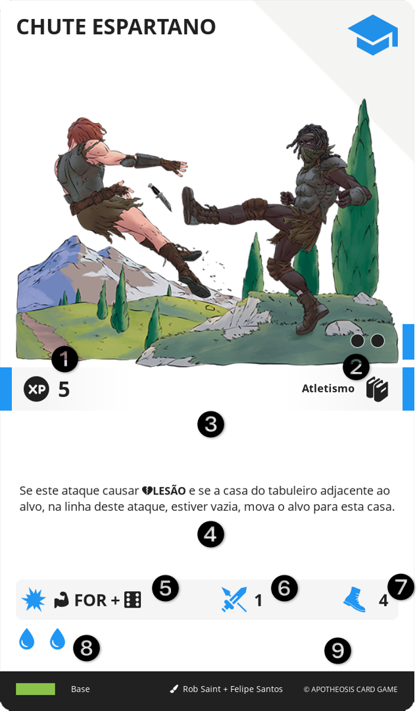

# HABILIDADE

Representam novas capacidades físicas, mentais e espirituais adquiridas por um personagem, conforme ganha experiência de vida, que concedem efeitos e modificadores.

||| :icon-file-moved:

||| :icon-arrow-down-right:
1.	Valor em XP
2.	Nível e Conhecimentos
3.	Bônus: Bônus passivo imediato providos por esta carta
4.	Efeito: Texto do efeito desta carta
5.	Dano
6.	Alcance
7.	Ação
8.	ESTAMINA
9.	MANA
|||

## ADQUIRIR
Para obter HABILIDADE, é necessário estar em um local de ACADEMIA. O personagem deve pagar 4 de AÇÃO, selecionar cartas acessível por aquela ACADEMIA e descartar cartas de HABILIDADE, cuja soma dos valores seja igual ou superior às das cartas selecionadas.

## APRENDER
Para baixar uma HABILIDADE do INVENTÁRIO para a MESA do personagem, é necessário pagar 2 de AÇÃO e que um espaço disponível no MEMENTO. A carta é então baixada deitada.

## ESQUECER
Para enviar uma HABILIDADE do seu MEMENTO para o seu INVENTÁRIO, pague 2 de AÇÃO.

## ATIVAR
Se uma HABILIDADE em seu MEMENTO, possuir "Custo de AÇÃO", você deve pagar este custo para executar seu efeito. Em adicional, deve deitar cartas do seu MEMENTO, cuja soma de suas ESTAMINA e a soma de suas MANA, sejam iguais ou superiores à da carta sendo executada.

LEVENTAR O TROCO: Caso seja deitada uma quantidade superior à necessária, você pode levantar cartas do MEMENTO, cuja soma de suas ESTAMINA e a soma de suas MANA, sejam iguais ou inferiores ao valor extra pago.

!!!
Note que a própria carta possui a quantidade de ESTAMINA e MANA que ela requer. Assim, deitar a própria carta já é o suficiente para ativá-la.

Uma HABILIDADE deitada não está de forma alguma "desativada", e pode ser usada normalmente, desde que pagos seus custos. A carta estar deitada, simboliza apenas que os recursos de ESTAMINA e MANA que ela disponibiliza, já foram utilizados.
!!!

Ao executar uma HABILIDADE, o jogador deve verificar se o efeito deve ser usado neste momento e se a HABILIDADE possui um ALCANCE. O que significa que ele deve selecionar um alvo no tabuleiro, que esteja dentro desse limite. Se a HABILIDADE também possuir um DANO, o alvo recebe este DANO.

## LIGNUM
É um conjunto de cartas de HABILIDADE interligadas. Você pode identificá-las pela presença do nome do LIGNUM antes do nome da carta, separados por um | (Barra Vertical).

Um espaço do MEMENTO pode conter até 3 cartas de um mesmo LIGNUM. É possível ter cartas de LIGNUM diferentes no MEMENTO, ocupando espaços diferentes. É possível aprender mais de 4 cartas de um LIGNUM no MEMENTO, ocupando mais de um espaço. Por exemplo, para ter 5 cartas de um LIGNUM no MEMENTO, pode-se colocar 3 cartas no primeiro espaço e 2 cartas no segundo espaço.

###  Cores de Mana

LIGNUM utiliza MANA de cor diferente à tradicional. Quando regras ou efeitos se referirem à MANA, estão falando de forma abrangente, incluindo tanto a tradicional, quanto a colorida. Porém para executar HABILIDADE com custo em MANA colorida, é preciso deitar aquela quantidade, daquela cor.

Observe que a colorida também pode ser tratada como tradicional, mas o inverso não é válido.

Quando você puder “levantar troco”, o troco deve ser da mesma cor ou tradicional.
